# Getting started with Unreal Engine and our ZED LiveLink plugin

We provide you an Unreal Project allowing to directly animate avatars with ZED LiveLink plugin skeleton data. It requires **Unreal Engine 4.26**.


This documentation aims to explain how joints informations (orientation and position) are brought by the ZED LiveLink plugin, and how to use them to animate an avatar directly in Unreal.


## ZED Live Link skeleton data: joint format

This section will present the joint format output by the ZED LiveLink plugin.

Live Link works with the notion of **Subject**, which is an individual stream of data, typically describing a given individual character.
For a given Live Link subject, at a given frame, we output a total of 32 joints, in the following order:


| Joint index | Joint name |
|-------------|------------|
| 0           |   PELVIS         |
| 1           |    SPINE_NAVAL        |
| 2           |  SPINE_CHEST          |
| 3           |   NECK         |
| 4           | CLAVICLE_LEFT           |
| 5           |    SHOULDER_LEFT        |
| 6           |  ELBOW_LEFT          |
| 7           |  WRIST_LEFT          |
| 8           |  HAND_LEFT          |
| 9           |   HANDTIP_LEFT         |
| 10           |    THUMB_LEFT        |
| 11          |   CLAVICLE_RIGHT         |
| 12          |   SHOULDER_RIGHT         |
| 13          | ELBOW_RIGHT           |
| 14          |    WRIST_RIGHT        |
| 15          |    HAND_RIGHT        |
| 16          |  HANDTIP_RIGHT          |
| 17          |   THUMB_RIGHT         |
| 18          |    HIP_LEFT        |
| 19          |   KNEE_LEFT         |
| 20           |  ANKLE_LEFT          |
| 21           |  FOOT_LEFT          |
| 22           |   HIP_RIGHT         |
| 23           |    KNEE_RIGHT        |
| 24          |   ANKLE_RIGHT         |
| 25          |   FOOT_RIGHT         |
| 26          | HEAD           |
| 27          |    NOSE        |
| 28          |    EYE_LEFT        |
| 29          |  EAR_LEFT          |
| 30          |   EYE_RIGHT         |
| 31          |    EAR_RIGHT        |


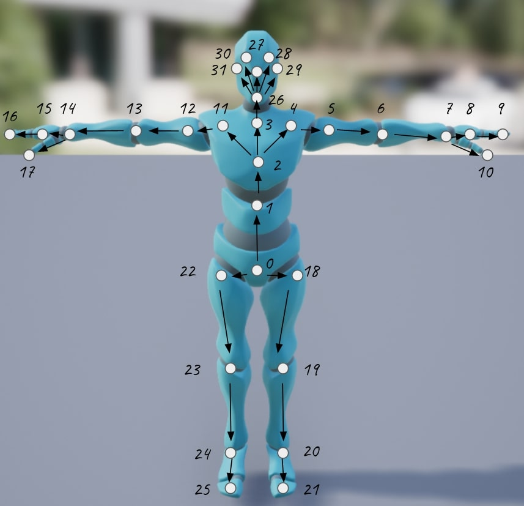

Our LiveLink plugin will feed local rotation and translation information for each of these joints. Local rotation for a joint is defined as its rotation relative to its parent joint. You can have an idea of the joint hierarchy on the previous image (a skeleton is basically a tree). We see that the root of this skeleton is the *PELVIS*, which has 3 children joints (*SPINE_NAVAL*, *HIP_LEFT* and *HIP_RIGHT*), etc. In addition to these local rotations (given in the form of a quaternion (x,y,z,w)) and translations, our LiveLink plugin will give the root global rotation and translation.


All these joints informations are expressed in Unreal coordinate frame, that is LEFT_HANDED_Z_UP. Each joint orientation will be expressed in the same coordinate frame you can see here for the avatar's hips:

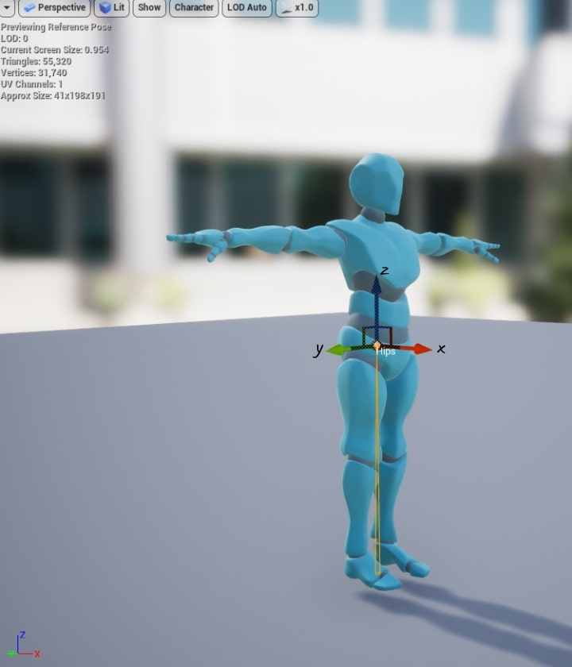

## Necessary transformation of SDK raw data in Unreal

To animate an avatar inside an Unreal project using raw SDK data fed by the ZED Live Link plugin, some operations must be done. The Unreal project we provide you already implements these transformations, and this section will explain how they are implemented. All these transformations are done using a **Remap Asset**.

The idea is first to create a new C++ class in your project, and select *LiveLinkRemapAsset* as its parent class.


In this class you'll be able to implement the following operations:


- Apply only Live Link rotations without modifying translations, except for the root. Indeed, Live Link default behaviour is to apply both translation and rotation data to the avatar, but you might prefer to apply only rotations and keep the local translation of the avatar to avoid deforming it.


- Change the root translation to adapt to your avatar's scale and make sure the avatar still has its feet on the floor. If an avatar is two times bigger than the skeleton output by the SDK, we will need to multiply the root translation by 2. There are two parameters to be handled here: first, the actual leg size of the avatar compared to the leg size of the skeleton coming from the SDK. You can get a first multiplication factor by checking these two sizes directly on the bones of the avatar. But the avatar might also have a scale not equal to 1. In this case, this scale won't actually alter the bone size of the avatar, so you need to take this scale into account in addition to the first factor. Consequently, the multiplication factor to apply to the root translation will be (avatarLegSize / SDKLegSize) * avatarScale.


- Apply extra rotations in case the avatar's T-Pose doesn't correspond to a situation where all its local orientations are null.

Let's explain a bit more the last point. Raw SDK orientations fed by LiveLink are output to be applied on an avatar who is in T-Pose when all its local orientations are null. The problem is that a lot of avatars you can import in Unreal will have a reference pose that is a T-Pose as excepted, but won't necessarily correspond to null orientations.

For instance, if you import this avatar from Mixamo, you'll see its reference pose is a T-Pose:

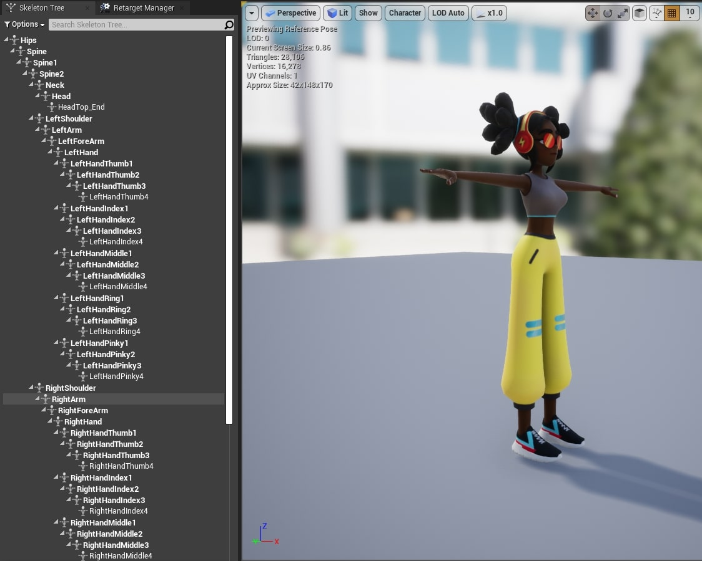

But by putting all its local orientations to 0, the resulting pose will be this:

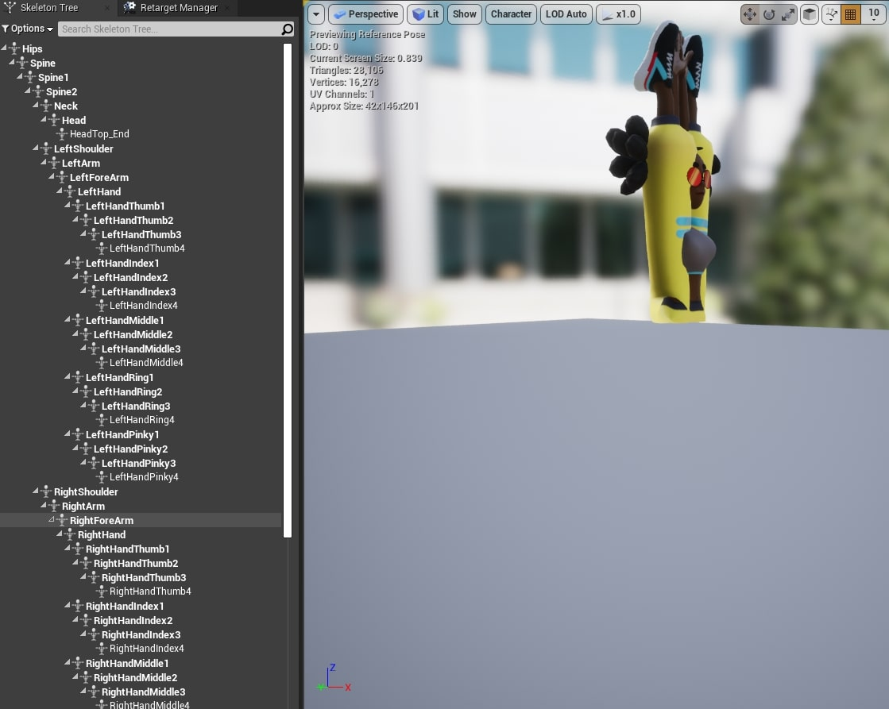

 In order to have an Unreal project that generalizes to a lot of avatars, it can be interesting to apply extra rotations to animate all avatars whose reference pose is a T-Pose.

So the idea is first to apply the actual rotation that puts the avatar from its "null orientations" pose to its T-Pose. This rotation information can be retrieved using [FBaseCompactPose::GetRefPose](https://docs.unrealengine.com/4.26/en-US/API/Runtime/Engine/FBaseCompactPose/GetRefPose/).

The problem is that after applying these rotations, the avatar is in T-Pose, but the rotated joints as well as their children won't be expressed in the same coordinate frame as before. For instance, you can see here that the avatar's left shoulder coordinate frame has been rotated with the same rotation applied to the joint:

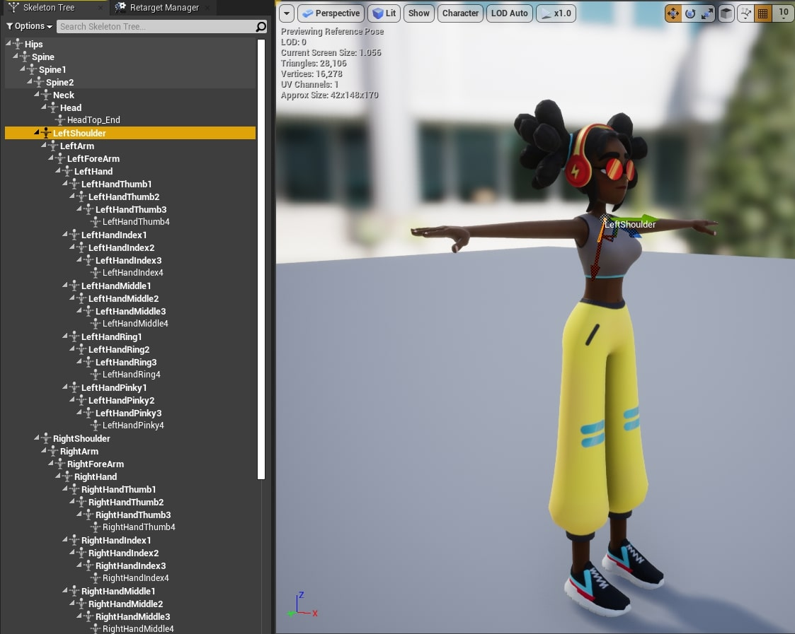

The SDK orientations are expressed in *LEFT_HANDED_Z_UP* coordinate frame with the avatar facing the +X axis, so we can't directly apply the orientations on this new coordinate frame. To apply rotations correctly, we must do the following:

- For each joint, apply the kinematic chain of all its parents joint rotation in order to put it in the right coordinate frame. For a given joint whose parent is the joint jn, we will apply R_j0 * R_j1 * ... R_jn where jn-1 is the parent of jn.
- Apply the SDK rotations, now that we are in the right coordinate frames.
- Apply the inverse kinematic chain computed in the first step to put the joints back in their coordinate frame.

You can find in the Unreal Project we provide you an implementation of these transformations that is directly useable: *[LiveLinkOrientationsRemapAsset](Source/ZEDUnrealLiveLink/LiveLinkOrientationsRemapAsset.cpp)*


Next, if your avatar bones don't have the same name than the ZED SDK  bone names (explained in the first section), you need to create a new Blueprint class, which parent class must be the C++ **Remap asset** class you just created.

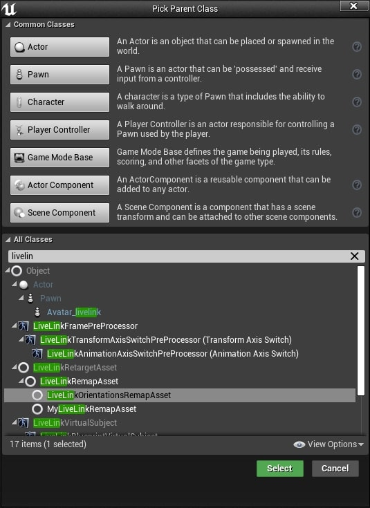

Open this blueprint class and override the function "GetRemappedBoneNames". There you must do a similar remapping than on the picture below, where bones explained in the first section must be mapped to their name in your imported avatar. The bone names in the "Switch on Name" node correspond to the bone names given by our LiveLink plugin, and the bone names in the "Return Node" nodes correspond to your imported avatar bone names.  The Unreal project we provided you has an example of such a Remap Asset useable for Mixamo avatars, called *MixamoRemap*.

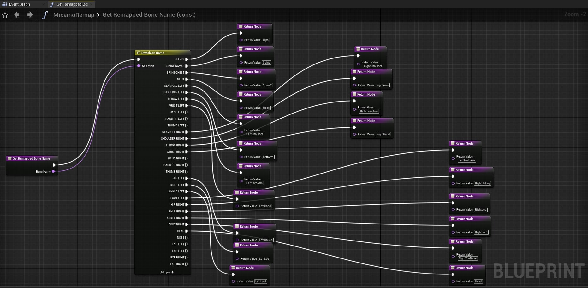

Once done, you must apply this **Remap Asset** to the Live Link data. Data from Live Link can be applied directly inside an Animation Blueprint, and when creating an Animation Blueprint for your avatar, you'll have to include a **Live Link Pose** node. This is where you can put the custom **Remap Asset** you created to transform the skeleton data coming from Live Link.

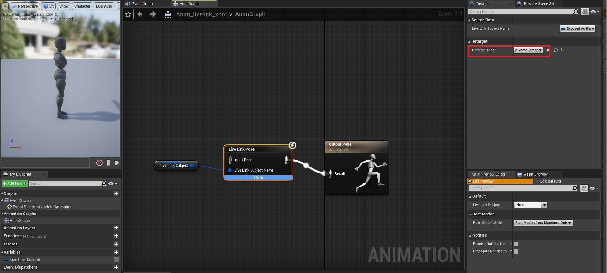

Implementing the above transformations will allow you to have a similar behaviour than with our provided Unreal project. In the rest of the documentation we'll assume you're using this provided Unreal project and we will explain how to directly animate an avatar and how to add new avatars to the project.


## Getting started with our Unreal Project

Open our *ZEDUnrealLiveLink.uproject* project. You'll see the following empty scene:

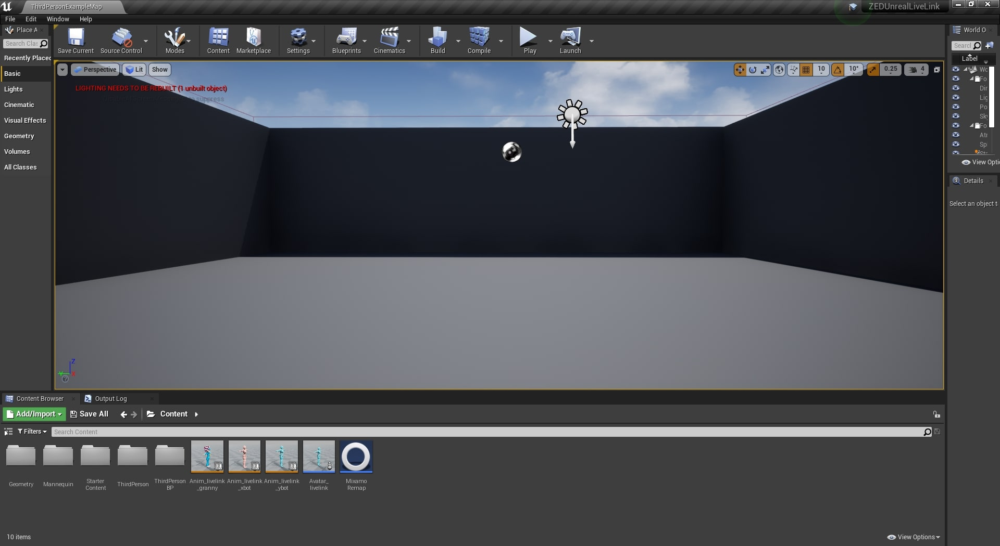

 In the Content folder of the editor, you'll see that there are already 3 Animation Blueprints, that correspond to 3 different avatars already imported in the project, as well as 2 assets called *Avatar_livelink* and *MixamoRemap*. We'll see in the section *Add a new avatar and animate it with our plugin* what's their use and how you can add your own assets to animate new avatars.

 This project already handles the Live Link skeleton data in order to instantiate correctly avatars and place them in the scene with the corresponding joint positions and orientations. If you want to see how this is done, you can check the project **Level Blueprint**.


## Enabling the Live Link Plugin

You can follow these steps if the Live Link Plugin is not enabled yet in your project.

1. Inside your project, In the Menu Bar under **Edit**, select **Plugins**.


2. Under the Animation section, click Enabled for Live Link, and Yes on the confirmation window, then restart the Editor.


## Using the ZED Live Link app

At this point, you must launch the ZED Live Link plugin that will send skeleton data to the Unreal project.

### With the Multicam API

The plugin requires the reloc file generated by the ZED Locator tool to run. It specify the position of each camera used by the multicamera API.

Once this file is generated :

1. Go to <Engine Install Folder>\Engine\Binaries\Win64\ZEDLiveLink and open a terminal.
2. Run ./ZEDLiveLink with the path of the rloc file as an argument.

For example, run :

```bash
$ ./ZEDLiveLink C:/UnrealEngine/ZEDLiveLink/ZED_Locator.json
```

### With the classic api

With the single camera API, the configuration file is not needed.
The input (ip, svo or serial number) can be provided directly as an argument.

To send data from a specific camera, add its serial number as arguments.
For example, to connect the camera whose serial number is 10028418, run :

```bash
$ ./ZEDLiveLink 10028418
```

3. You can see the connection status in the terminal.

- On Windows :


- On Linux :


## Connecting Live Link source to UE4

This step is normally handled automatically by the Unreal Project provided. If you have data coming from several Live Link sources, you might need to do the following to make sure you're connected to the right source.

1. Inside the UE4 Editor, from the Menu Bar under **Window**, select **Live Link**.


2. In the Live Link window, click the **Source** button, then under Message Bus Source, select your ZED source.


## Animate default avatar

With the project you're provided, you can animate a default avatar by directly hitting play in Unreal. You will see avatars animated with skeleton data coming from the connected Live Link source:


## Add a new avatar and animate it with our plugin

The Unreal project we provided you already contains avatars you can animate. This section will explain how to import a new avatar to make it work with our ZED LiveLink plugin. You can find various avatars on [Mixamo website](https://www.mixamo.com/) for instance. You should follow these steps:


### 1. Importing a new avatar
For now, our plugin allows to animate correctly an avatar if it is imported in the right format. We need the avatar to respect two conditions:

- The first condition is on the avatar's reference pose. The reference pose is the the default pose of the avatar you can see when you open the skeleton asset window. We need this reference pose to be in T-Pose, which corresponds to the pose where the avatar is standing up with its arms held horizontally.

- The second condition is on the avatar's global orientation when imported. We want to start from a known orientation, so we need the avatar to be facing the +X direction in its reference pose.

To respect the first condition, you might need to change your avatar's reference pose if it isn't already a T-Pose. You can change its reference pose using **Blender**, for instance. Let's take the example of this robot avatar, that initally has an "A-Pose":


You can change its reference pose this way:

1. Select the **Armature** of your avatar in the **Scene Collection** and select the **Pose Mode** this way:


2. For each bone that needs to be rotated, click on it and go to **Pose/Transform/Rotate**:


Once you did all the necessary rotations and that your avatar appears in T-Pose, you can define it as the new reference pose (which is called *Rest Pose* in **Blender**). Go to **Pose/Apply** and select **Apply Pose as Rest Pose**:


You can then export your avatar as an FBX object and its reference pose will be the T-Pose you defined.

When you import your avatar in Unreal, you'll have to tick the checkboxes *Update Skeleton Reference Pose* and *Use T0 As Ref Pose* to make sure the avatar's reference pose in Unreal is the one you just defined in Blender.

Moreover, in order to meet the second condition, you'll have to tick the checkbox *Force Front X Axis* to force the avatar to look at the +X direction. This way we make sure the avatar starts with a known orientation.

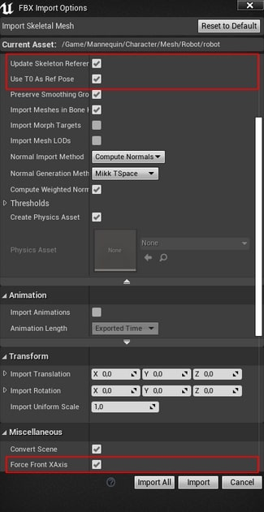

Make sure, by checking the avatar skeleton asset, that its reference pose is in T-Pose, and is looking at the +X direction. This should look like this:


### 2. Creating a Remap Asset

Once you imported the avatar, the next thing to do is to create a **Remap Asset**. Indeed, your avatar joints probably don't have the same name than the one given by our plugin. It's for example the case with Mixamo avatars we used in the Unreal project you're provided. Live Link gives the possibility to remap these bone names. Create a new Blueprint class, which parent class must be "LiveLinkOrientationsRemapAsset".


Open this blueprint class and override the function "GetRemappedBoneNames". There you must do a similar remapping than on the picture below, where bones explained in the first section must be mapped to their name in your imported avatar. The bone names in the "Switch on Name" node correspond to the bone names given by our LiveLink plugin, and the bone names in the "Return Node" nodes correspond to your imported avatar bone names.  The Unreal project we provided you has an example of such a Remap Asset useable for Mixamo avatars, called *MixamoRemap*.


### 3. Creating an Animation Blueprint

Data from Live Link can be applied directly inside Animation Blueprints.

When creating an Animation Blueprint, a dialog box will allow you to select its "Target Skeleton". Choose the skeleton created when you imported your avatar.

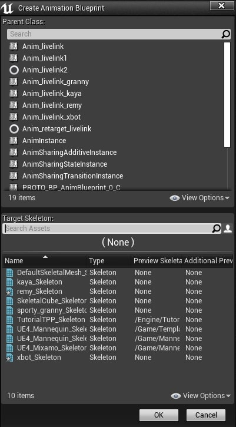

This is achieved by creating a Live Link Pose node inside the AnimGraph of an Animation Blueprint:
- Create a variable **Live Link Subject** and put it in the AnimGraph. It refers to the name of the subject in LiveLink to stream data from. In case several persons are detected, this variable will feed the right skeleton data to the right avatar.
- Link it to a **Live Link Pose** node, which will get the actual skeleton data from our Live Link Subject.
- Link this node to the **Output Pose**, this way the Live Link skeleton data will directly animate our avatar.

In the "Details" menu of the **Live Link Pose** node, you have the possibility to select a retarget asset. This is where you must select the Remap Asset you created in the previous step, in order to remap correctly the Live Link skeleton data to your avatar bone names.

The AnimGraph should look like this:


You can refer to  the existing Animation Blueprints in the Unreal project to configure yours the same way.

### 4. Configuring "Avatar_livelink" asset

Next, you must select the "Avatar_livelink" asset already provided in the Unreal Project. The role of this asset is to define which avatar will be animated in the Unreal scene. In the "Skeletal Mesh" details menu, you must select the Skeletal Mesh you imported and want to use, and the Anim Class linked to this mesh that you previously created.

The Live Link Skeletal Animation component has be added to this Actor in order to drive its parameters with Live Link from a connected external source.

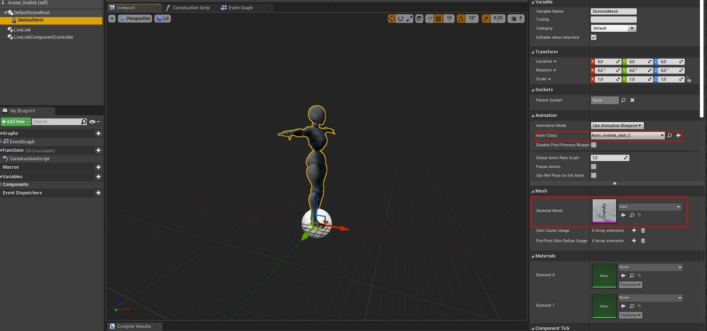

### 5. Configuring project level blueprint

Once the "Avatar_livelink" is set, last step is to open the Level Blueprint of the project. This Level Blueprint automatically connects the project to the Live Link Source at Play, and a Avatar_livelink Actor is instantiated for each skeleton sent by the LiveLink plugin, in order to be rendered on the Unreal scene.

At the right side of the EventGraph, you will notice two nodes "Cast To Anim_livelink" and "SET Live Link Subject".

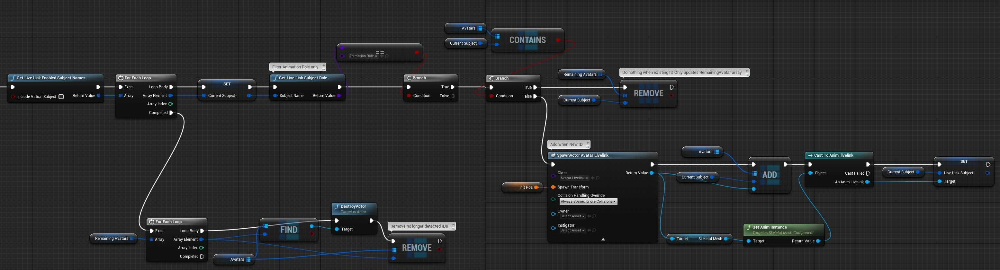

The idea is to replace these nodes with a cast to your own Animation Blueprint you created for your avatar. Remove the two current nodes (or suppress their links to rest of the graph), and create a cast to your own Animation Blueprint, as well as a set to its "Live Link Subject" variable. Reproduce the same connections set before with your Animation Blueprint.


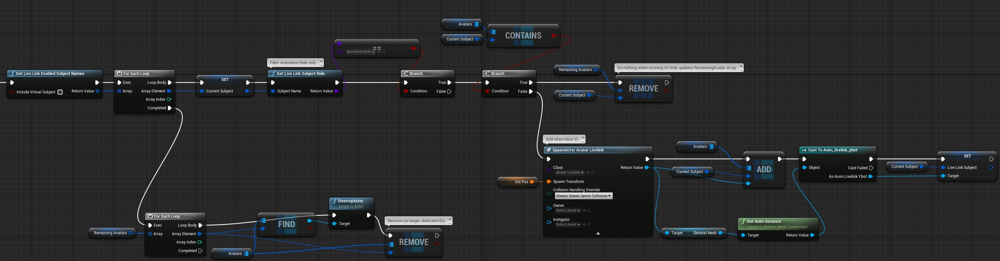

Once done, you're ready to press play and see your avatar animated with LiveLink data.
