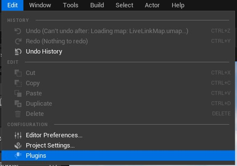
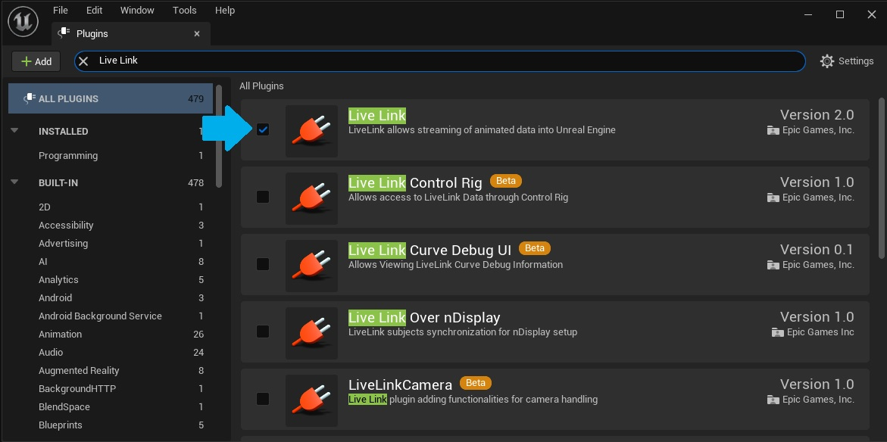

# Stereolabs ZED - Live Link Sample
ZED LiveLink Sample for Unreal

## Fusion API

This sample is using the Fusion API of the ZED SDK. This allows to fuse data between multiples cameras in order to increase the stability and the quality of the skeleton data.
Therefore, this sample requires the ZED SDK v4.0 to run.

## ZED Live Link tool

This tool is using the Live Link plugin to connect Unreal engine 5 to the ZED SDK, which enables you to send skeleton tracking data to UE5. This way, you can control a Skeletal Mesh in real-time using the Skeleton tracking module of the ZED SDK.

It can be send through local network on Windows and Linux computers.

## Getting started

 - First, download the latest version of the ZED SDK on [stereolabs.com](https://www.stereolabs.com/developers/)
- For more information, read the ZED [Documentation](https://www.stereolabs.com/docs) and [live link documentation](https://www.stereolabs.com/docs/livelink/)


To compile the tool from source, you will require a source build of Unreal Engine. For more information, read the [Building ZED Live Link Plugin](https://www.stereolabs.com/docs/livelink/building-the-plugin/) documentation page.

## Using ZED Live Link

We provide you an Unreal project that already contains the different assets necessary to animate avatars properly using the **ZED Live Link** skeleton data.

You will be able to use directly this project by hitting play while the **ZED Live Link sample** is running and see a default avatar animate. We are showing how to add your own models here: [Animate New Avatar](/livelink/animate-new-avatar/).

In this tutorial, you'll learn how to use our **ZED Live Link sample**, connect it to our Unreal Project and animate a default avatar with the **Live Link** skeleton data. You must follow these steps:

### 1. Download the Engine

To gain access to the UE engine code, please follow the steps below:

1. Create an account at GitHub: [Sign up](https://github.com/join)
2. Create an account at Epic Games: [Sign up](https://accounts.epicgames.com/login)
3. Login to your Epic Games account and associate your GitHub account in the settings by entering your username into the GitHub account field.
5. Login to your Github account and accept the Epic team invitation* (Can take a few seconds to appear).
4. Download or clone the [UE5 engine](https://github.com/EpicGames/UnrealEngine/tree/release) code.

> The link above will result in a 404 error if your GitHub account is not linked to an Epic Game one. Make sure to follow all the instructions above.

> *If the invitation isn't sent, clicking on the following link seems to trigger it: [Unreal Group](https://github.com/orgs/EpicGames).

### 2. Open the Unreal Project

Open our *ZEDUnrealLiveLink.uproject* project.

* In your project root directory right click on the **ZEDUnrealLiveLink.uproject** file and select **Generate Visual Studio project files** in the context menu.
* Open Visual Studio and compile. Launch the project from the **uproject** file or Visual Studio.

If these options are not available, make sure your Visual Studio install is correctly setup.

 ### 3. Enable the Live Link Plugin in Unreal

You can follow these steps if the Live Link Plugin is not enabled yet in your project.

1. Inside your project, In the Menu Bar under **Edit**, select **Plugins**.





2. Under the Animation section, click Enabled for Live Link, and Yes on the confirmation window, then restart the Editor.




### 4. Select the remap asset

The ZED SDK now has multiple skeleton formats (Body 34, 38, and 70) available for animating a 3D model.
You need to make sure the correct remap asset is selected in the Anim Blueprint of Actor you are using in your level. Indeed, each body format has its own remap asset (as the name and numbers of joint is different).
The remap asset **must** be set in the **Anim blueprint**, in the **ZED Livelink** pose component.

For example, if you are using the Body format *Body_38*, open the **ABP_ZED_Manny** anim blueprint, select the **ZED LivelinkPose** component and, in the Detail panel, set the **Remap Asset** field to **RemapAssetBody38**


### 4. Run ZED Live Link

The release 4.0 of the ZED SDK introduced the Fusion API which allow you to fuse skeleton data from multiples cameras. This features is also supported in the project.

At this point, you must run the ZED Live Link executable. It will call the ZED SDK in order to compute skeleton data and stream it to the Unreal project. So you must make sure to have the ZED SDK installed on the machine that will run the ZED Live Link sample.

A pre-built `ZEDLiveLinkFusion` sender for the current SDK version is located in `zed-livelink/zed-livelink-fusion/Releases/your system/`.

To learn how to build the ZED Live link sample yourself, take a look at our [Build Zed Live Link](/livelink/building-the-plugin/) documentation page.

- Open a terminal in the folder containing the ZED Live Link executable, and run

```bash
$ ./ZEDLiveLinkFusion
```

#### Adjust ZED SDK Parameters

The ZED Live link sample requires a configuration file (Json format) to run. This file contains all the parameters from the ZED SDK that can be modified in this sample.
By default, the sample will try to open a json called "ZEDFusionLiveLinkConfig.json" located next to this executable.

The Fusion API requires a calibration file to be able to fuse the data from multiple camera.
This file cam be generated using the ZED 360 tool available with the ZED SDK. Once your calibration file is ready, 
in the ZEDFusionLivelink.json file, set the value of **json_config_filename** to the path to this calibration file.

The configuration file looks like this :

 ```json
{
    "InitParameters":
    {
        "resolution": "HD1080",
        "fps": 30,
        "depth_mode": "ULTRA"
    },
    "BodyTrackingParameters":
    {
        "detection_model": "HUMAN_BODY_ACCURATE",
        "body_format": "BODY_38",
        "body_selection": "FULL",
        "confidence": 40,
        "max_range": -1,
        "minimum_keypoints_threshold" : -1
    },
    "InitFusionParameters":
    {
        "json_config_filename": "",
        "output_performance_metrics": true,
        "verbose": false
    },
    "BodyTrackingFusionParameters":
    {
        "skeleton_minimm_allowed_keypoints": -1,
        "skeleton_minimum_allowed_camera": -1,
        "skeleton_smoothing": 0
    }
}
 ```

You can get more information about the different parameters role by looking at the [API documentation](https://www.stereolabs.com/docs/api/).

By default, the Live Link sample will try to open a json file called **ZEDFusionLiveLinkConfig.json** next to the executable.

But you can also give the path to your config file as an argument when running the Live Link sample : 

```bash
$ ./ZEDLiveLinkFusion path/to/config/file.json
```

### Troubleshooting

- Your firewall might block the data stream. If you do not see the ZED Source in the Live Link window, try to disable it. 

- If the ZED Source is not detected in UnrealEngine, enable **Enable by default** in **Edit** -> **Project Settings** -> **UDP Messaging** -> **Enable by default**


- You might also need to specify the "Unicast Endpoint" parameter if you are using the same machine for the ZED Livelink sample and the Unreal Project. In this case,
set the parameter to "127.0.0.1".

#### On Linux

If the plugin crashes at the start, try to run the ldd command onto the sl_zed_c.so library :

```bash
$ ldd libsl_zed_c.so
```
It will show all the dependencies required by the .so and allow you to install anything that might be missing (for example lib-usb).


Note that the c wrapper used for the Live link plugin is also available here : https://github.com/stereolabs/zed-c-api.

If you encounter issues running the live link plugin, do not hesitate to build the wrapper yourself and place it in the `lib/win64` or `lib/linux` folder.
